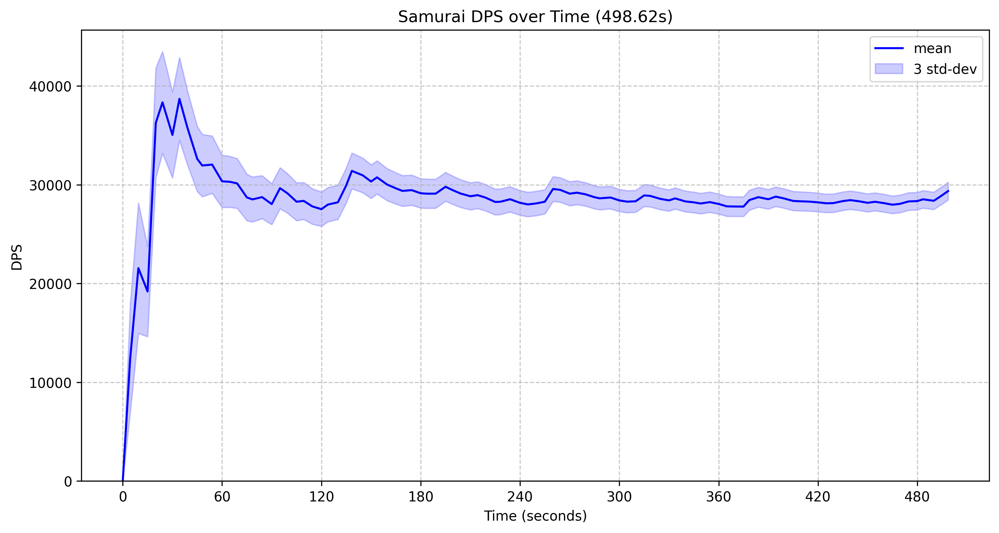

[查看中文版本 (View in Chinese)](README_CN.md)

# FFXIV Combat Simulator

This project is a Python-based combat simulator for Final Fantasy XIV, designed to analyze job rotations and estimate damage output. It currently features a detailed simulation for the Samurai job, with tools for Monte Carlo analysis and visualization of DPS and total damage over time.

## Project Philosophy 🤔

The core principle of this project is to provide a robust engine for **calculation and analysis** of FFXIV combat scenarios. It is not intended to be a tool for creating beautiful visualizations or an automated rotation planner for optimization. Users who require such features are encouraged to build their own GUI or analysis tools on top of the simulation core provided here.

## Project Structure

- `main.py`: Main script to run simulations. It demonstrates setting up a character, running a Samurai rotation, and analyzing the results.
- `montecarlo.py`: Provides utilities for Monte Carlo simulations, offering different strategies (standard, parallel, memory-efficient) for damage distribution analysis.
- `convert_rotation.py`: A script to convert action sequences from a text file format to the JSON format used by the simulator. THIS is mainly used for reading my old rotation data which was saved in txt format. Write your old adator if you want to load data from other sources.
- `requirements.txt`: Lists the Python dependencies for this project.
- `xivcore/`: This directory contains the core logic for the simulation.
    - `core.py`: Core simulation engine, handling events, character states, and combat mechanics.
    - `common.py`: Common data structures and utilities, such as character gear sets and action definitions.
    - `xivstats.py`: Likely contains statistical models or data related to FFXIV combat.
    - `task.py`: Defines task structures for the simulation.
    - `job/`: Contains implementations for specific FFXIV jobs.
        - `samurai.py`: Detailed implementation for the Samurai job.
        - Other files (e.g., `blackmage.py`, `ninja.py`) are placeholders for future job implementations.
- `rotations/`: Contains JSON files defining character gear sets and rotations used in simulations (e.g., `sam_820.json`).
- `dps_over_time.png`, `total_damage_over_time.png`: Example plots generated by the simulation.

## Features

- **Combat Simulation**: Simulates FFXIV combat scenarios, focusing on job rotations.
- **Job Support**: Includes a detailed implementation for the jobs (currently only SAM).
- **Monte Carlo Analysis**: Uses Monte Carlo methods to analyze damage distributions and estimate DPS.
- **Multiple Simulation Strategies**: Offers standard, parallel, and memory-efficient simulation methods.
- **DPS Visualization**: Generates plots for DPS over time and total damage over time.
- **Rotation Conversion**: Provides a script to convert rotations from a simple text format to JSON.
- **Multiplayer Simulation**: Supports simulating combat scenarios with multiple players interacting within the same environment.

## Supported Jobs ⚔️

- **Samurai (SAM)**: Fully implemented and the primary focus of current simulations. 侍
- Other jobs (e.g., Black Mage ✨, Ninja 🥷, Viper 🐍, Pictomancer 🎨): Placeholders exist, planned for future development.

## Example Output 📊

Here's an example of the DPS over time plot generated by the simulator:



### Example Command Line Output

Below is an example of the kind of detailed analysis output you might see in the command line after a simulation run:

```text
[658] +08:07.908: ATTACK                      6624.09 ±   1617.6
[659] +08:09.940: KASHA                       35255.1 ±  8608.87
[660] +08:10.204: ATTACK                      6624.09 ±   1617.6
[661] +08:10.640: HISSATSU_SHINTEN           20983.79 ±   5124.2
[662] +08:13.010: TENDO_SETSUGEKKA          128757.24 ± 14746.74
[663] +08:13.410: ATTACK                      6624.09 ±   1617.6
[664] +08:13.510: HISSATSU_SENEI             67160.55 ± 16399.86
[665] +08:14.280: TENDO_KAESHI_SETSUGEKKA   128757.24 ± 14746.74
[666] +08:15.680: ZANSHIN                    78912.81 ± 19269.67
[667] +08:15.706: ATTACK                      6624.09 ±   1617.6
[668] +08:17.350: OGI_NAMIKIRI              117052.67 ± 13406.16
[669] +08:17.850: SHOHA                      53727.88 ± 13119.53
[670] +08:18.002: ATTACK                      6624.09 ±   1617.6
[671] +08:18.620: KAESHI_NAMIKIRI           117052.67 ± 13406.16

Gearset:
武士 7.05 BiS 2.17GCD
  SAMURAI(34) Lv.100
  Party Bonus: 1.05
  Weapon Damage: 146.0
  Weapon Delay: 2.64
  Main Attribute: 4872
  Critical Hit: 2896
  Determination: 2168
  Direct Hit: 2338
  Speed: 420

Auto-Attacks: 206

Total damage: 14,643,086.88 ± 149,157.07 (498.62s)
DPS: 29367.23 ± 299.14

Monte-Carlo Simulation:
Running parallel simulation with 672 damage records and 100,000 fights using 24 CPU cores...
Sampling: |██████████████████████████████████████████████████| 100.0% | 6.5s<0.0s | Action 665 Complete
DPS: 29366.30 ± 938.76
    75.0%: 28716.55
    50.0%: 29334.36
    25.0%: 29982.26
    10.0%: 30591.20
     9.0%: 30652.12
     8.0%: 30716.91
     7.0%: 30788.13
     6.0%: 30867.66
     5.0%: 30961.18
     4.0%: 31066.52
     3.0%: 31205.38
     2.0%: 31388.03
     1.0%: 31660.35
     0.5%: 31932.27
     0.1%: 32496.44
```

## Installation 💾

1.  **Clone the repository (if you haven't already):**
    ```bash
    git clone https://github.com/memorycopy/ffxiv_cli
    cd ffxiv_cli
    ```
2.  **Install dependencies:**
    Make sure you have Python and pip installed. Then, navigate to the project directory in your terminal and run:
    ```bash
    pip install -r requirements.txt
    ```
    *Note: `numba` is an optional dependency used for some simulation methods in `montecarlo.py`. The simulator will function without it, but certain performance optimizations might not be available.*

## How to Run

1.  **Define a rotation**: Rotations can be defined in a text file and converted to JSON using `convert_rotation.py`, or directly created as a JSON file in the `rotations/` directory.
2.  **Configure the simulation**: Modify `main.py` to specify the character, gear set, rotation file, and simulation parameters (e.g., fight duration, number of simulations).
3.  **Run the simulation**: Execute `main.py`:
    ```bash
    python main.py
    ```
4.  **View results**: The script will output DPS statistics and generate plots (`dps_over_time.png`, `total_damage_over_time.png`).

## Custom Simulation Setup Example 🛠️

Here's a basic example of how to set up a custom simulation with a player and an enemy:

```python
import xivcore.job
from xivcore.common import CharacterGearset
from xivcore.core import Arena, Player, BattleCharacter, Rotation

# Simulation parameters
SIMULATION_TIME_MS = 5 * 60 * 1000  # 5 minutes
ROTATION_FILE_PATH = "rotations/sam_820.json" # Example Samurai rotation

# 1. Initialize the Arena (simulation world)
# Start 30 seconds before combat for pre-pull actions
world = Arena(time=-30000)

# 2. Create and configure player(s)
# Load gearset from a rotation JSON (can also be defined manually)
gearset = CharacterGearset.from_rotation_json(ROTATION_FILE_PATH)
player1 = Player(entity_id=1, gearset=gearset)

# Register job-specific actions (e.g., Samurai)
xivcore.job.register_common_actions(player1)
xivcore.job.samurai.register_samurai_actions(player1) # Replace with other jobs as needed

# Add player to the world
world.add_player(player1)

# (Optional) Add more players for multiplayer simulation
# gearset_player2 = ...
# player2 = Player(entity_id=3, gearset=gearset_player2)
# xivcore.job.register_common_actions(player2)
# xivcore.job.ninja.register_ninja_actions(player2) # Example for a Ninja
# world.add_player(player2)

# 3. Create and configure enemy/boss(es)
# Simple dummy target
enemy1 = BattleCharacter(entity_id=2)
world.add_enemy(enemy1)

# (Optional) Add more enemies
# enemy2 = BattleCharacter(entity_id=4, hp=1000000) # Enemy with specific HP
# world.add_enemy(enemy2)

# 4. Start server ticks (important for DoTs and other timed effects)
world.start_server_tick()

# 5. Define and assign rotation to player(s)
rotation1 = Rotation.load_from_json(ROTATION_FILE_PATH)
player1.set_rotation(rotation1)
# For multiplayer, assign rotations to other players as well

# 6. Set targets and start rotations
player1.set_target(enemy1)
player1.start_rotation()
# For multiplayer, set targets for other players (they can target same or different enemies)
# player2.set_target(enemy1)
# player2.start_rotation()

# 7. Run the simulation
print(f"Starting custom simulation for {SIMULATION_TIME_MS / 1000} seconds...")
world.step(frame_delta=SIMULATION_TIME_MS - world.current_time)
print("Simulation finished.")

# 8. Analyze results (e.g., inspect enemy1.damage_taken)
# (Refer to main.py or montecarlo.py for more detailed analysis examples)
for i, record in enumerate(enemy1.damage_taken):
    print(f"[{i:03d}] {record}")

# For Monte Carlo analysis, you would typically collect damage_taken from the enemy
# after one simulation run (like above, but often shorter for generating a baseline log),
# and then feed that into the MonteCarloSimulator.
```

This example provides a starting point. You can expand upon it to create more complex scenarios with multiple players, different jobs, multiple enemies, and custom event handling if needed. Refer to `main.py` and `montecarlo.py` for more advanced usage and analysis techniques.

## Future Development Directions

- Implementations for other FFXIV jobs (Black Mage ✨, Ninja 🥷, Viper 🐍, Pictomancer 🎨, and more!) 
    - ```If I have time and are willing to. Don't look forward to. DIY 😅🛠️```.
- More sophisticated statistical analysis and reporting.
- GUI for easier configuration and result visualization. 

## Author

- memcpy@红玉海

## Credits 🙏

- Formulas and Data(Modifiers, etc) from **Allagan Studies** community: their invaluable resources and in-depth analysis of FFXIV game mechanics, which have been a great reference for this project. 
- The gearset stats calculation logic is inspired by and references code from [Asvel/ffxiv-gearing](https://github.com/Asvel/ffxiv-gearing). 

## License 📄

This project is licensed under the MIT License - see the [LICENSE](LICENSE) file for details.