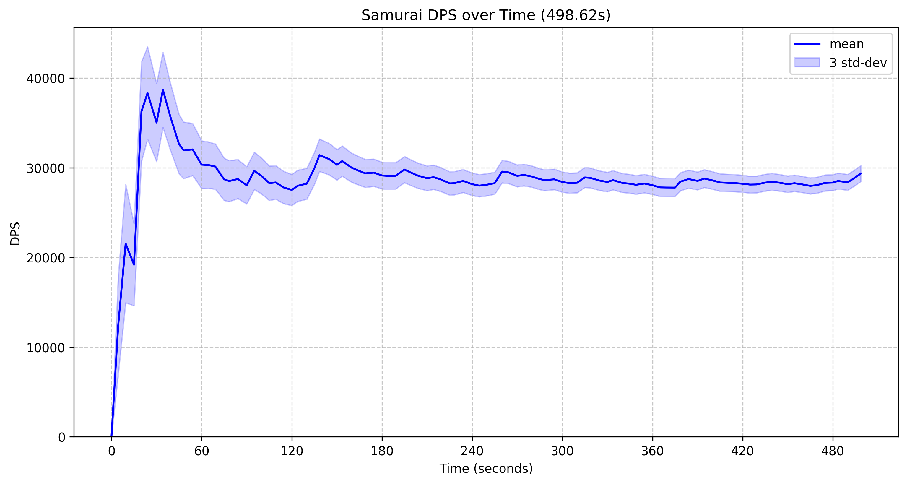

[查看英文版本 (View in English)](README.md)

# FFXIV 战斗模拟器

本项目是一个基于 Python 的《最终幻想14》战斗模拟器，旨在分析职业循环并估算伤害输出。目前，模拟器框架本身虽然可以支持团伤害计算，但因为只实现了武士职业的战斗逻辑，并为此实现了一个简单的蒙特卡洛分析工具以及DPS和总伤害随时间变化的可视化功能。

## 项目理念 🤔

本项目的核心原则是为FFXIV战斗场景的**计算和分析**提供支持。它并非旨在成为一个创建精美可视化图表或自动化循环优化规划器的工具。需要此类功能的用户，建议自行修改或在本项目提供的模拟核心之上构建自己的GUI或分析工具。

## 项目结构

- `main.py`: 运行模拟的主脚本。它演示了如何设置角色、运行武士循环以及分析结果。
- `montecarlo.py`: 提供蒙特卡洛模拟的实用工具，为伤害分布分析提供不同的策略（标准、并行、内存优化）。
- `convert_rotation.py`: 一个将纯文本格式的技能序列转换为模拟器使用的JSON格式的脚本。这主要用于读取我旧的以txt格式保存的循环数据。如果你想从其他来源加载数据，请编写自己的适配器。
- `requirements.txt`: 列出本项目的Python依赖项。
- `xivcore/`: 此目录包含模拟的核心逻辑。
    - `core.py`: 核心模拟引擎，处理事件、角色状态和战斗机制。
    - `common.py`: 通用数据结构和实用工具，例如角色装备组合和技能定义。
    - `xivstats.py`: 可能包含与FFXIV战斗相关的统计模型或数据。
    - `task.py`: 定义模拟的任务结构。
    - `job/`: 包含特定FFXIV职业的实现。
        - `samurai.py`: 武士职业的详细实现。
        - 其他文件（例如 `blackmage.py`, `ninja.py`）是未来职业实现的占位符。
- `rotations/`: 包含JSON文件，定义了模拟中使用的角色装备和职业循环 (例如 `sam_820.json`)。
- `dps_over_time.png`, `total_damage_over_time.png`: 模拟器生成的示例图表。

## 功能特性

- **战斗模拟**: 模拟FFXIV战斗场景，专注于职业循环。
- **职业支持**: 包含对一些职业的详细实现（目前仅支持武士SAM）。
- **蒙特卡洛分析**: 使用蒙特卡洛方法分析伤害分布并估算DPS。
- **多种模拟策略**: 提供标准、并行和内存优化等多种模拟方法。
- **DPS 可视化**: 生成DPS随时间变化和总伤害随时间变化的图表。
- **循环转换**: 提供一个脚本，可将职业循环从简单的文本格式转换为JSON格式。
- **多人模拟**: 支持模拟多个玩家在同一环境中交互的战斗场景。

## 已支持职业 ⚔️

- **武士 (SAM)**: 完全实现，是当前模拟的主要焦点。 侍
- 其他职业 (例如 黑魔法师 ✨, 忍者 🥷, 蝰蛇镰 🐍, 绘灵法师 🎨): 已存在占位符，计划将来开发。

## 输出示例 📊

这是模拟器生成的DPS随时间变化图表示例：



### 命令行输出示例

以下是模拟运行后您可能在命令行中看到的详细分析输出示例：

```text
[658] +08:07.908: ATTACK                      6624.09 ±   1617.6
[659] +08:09.940: KASHA                       35255.1 ±  8608.87
[660] +08:10.204: ATTACK                      6624.09 ±   1617.6
[661] +08:10.640: HISSATSU_SHINTEN           20983.79 ±   5124.2
[662] +08:13.010: TENDO_SETSUGEKKA          128757.24 ± 14746.74
[663] +08:13.410: ATTACK                      6624.09 ±   1617.6
[664] +08:13.510: HISSATSU_SENEI             67160.55 ± 16399.86
[665] +08:14.280: TENDO_KAESHI_SETSUGEKKA   128757.24 ± 14746.74
[666] +08:15.680: ZANSHIN                    78912.81 ± 19269.67
[667] +08:15.706: ATTACK                      6624.09 ±   1617.6
[668] +08:17.350: OGI_NAMIKIRI              117052.67 ± 13406.16
[669] +08:17.850: SHOHA                      53727.88 ± 13119.53
[670] +08:18.002: ATTACK                      6624.09 ±   1617.6
[671] +08:18.620: KAESHI_NAMIKIRI           117052.67 ± 13406.16

Gearset:
武士 7.05 BiS 2.17GCD
  SAMURAI(34) Lv.100
  Party Bonus: 1.05
  Weapon Damage: 146.0
  Weapon Delay: 2.64
  Main Attribute: 4872
  Critical Hit: 2896
  Determination: 2168
  Direct Hit: 2338
  Speed: 420

Auto-Attacks: 206

Total damage: 14,643,086.88 ± 149,157.07 (498.62s)
DPS: 29367.23 ± 299.14

Monte-Carlo Simulation:
Running parallel simulation with 672 damage records and 100,000 fights using 24 CPU cores...
Sampling: |██████████████████████████████████████████████████| 100.0% | 6.5s<0.0s | Action 665 Complete
DPS: 29366.30 ± 938.76
    75.0%: 28716.55
    50.0%: 29334.36
    25.0%: 29982.26
    10.0%: 30591.20
     9.0%: 30652.12
     8.0%: 30716.91
     7.0%: 30788.13
     6.0%: 30867.66
     5.0%: 30961.18
     4.0%: 31066.52
     3.0%: 31205.38
     2.0%: 31388.03
     1.0%: 31660.35
     0.5%: 31932.27
     0.1%: 32496.44
```

## 安装 💾

1.  **克隆仓库 (如果尚未克隆):**
    ```bash
    git clone https://github.com/memorycopy/ffxiv_cli
    cd ffxiv_cli
    ```
2.  **安装依赖:**
    请确保您已安装 Python 和 pip。然后，在终端中导航到项目目录并运行：
    ```bash
    pip install -r requirements.txt
    ```
    *注意: `numba` 是一个可选依赖项，用于 `montecarlo.py` 中的某些模拟方法。即使没有它，模拟器也能正常运行，但某些性能优化可能无法使用。*

## 如何运行

1.  **定义循环**: 可以在文本文件中定义循环，并使用 `convert_rotation.py` 将其转换为JSON，或者直接在 `rotations/` 目录中创建JSON文件。
2.  **配置模拟**: 修改 `main.py` 以指定角色、装备、循环文件和模拟参数 (例如，战斗时长、模拟次数)。
3.  **运行模拟**: 执行 `main.py`：
    ```bash
    python main.py
    ```
4.  **查看结果**: 脚本将输出DPS统计数据并生成图表 (`dps_over_time.png`, `total_damage_over_time.png`)。

## 自定义模拟设置示例 🛠️

以下是如何使用一名玩家和一名敌人设置自定义模拟的基本示例：

```python
import xivcore.job
from xivcore.common import CharacterGearset
from xivcore.core import Arena, Player, BattleCharacter, Rotation

# 模拟参数
SIMULATION_TIME_MS = 5 * 60 * 1000  # 5 分钟
ROTATION_FILE_PATH = "rotations/sam_820.json" # 示例武士循环

# 1. 初始化 Arena (模拟世界)
# 战斗开始前30秒，用于开怪前准备动作
world = Arena(time=-30000)

# 2. 创建并配置玩家
# 从循环JSON加载装备 (也可以手动定义)
gearset = CharacterGearset.from_rotation_json(ROTATION_FILE_PATH)
player1 = Player(entity_id=1, gearset=gearset)

# 注册职业特定技能 (例如 武士)
xivcore.job.register_common_actions(player1)
xivcore.job.samurai.register_samurai_actions(player1) # 根据需要替换为其他职业

# 将玩家添加到世界中
world.add_player(player1)

# (可选) 为团伤模拟添加更多玩家
# gearset_player2 = ...
# player2 = Player(entity_id=3, gearset=gearset_player2)
# xivcore.job.register_common_actions(player2)
# xivcore.job.ninja.register_ninja_actions(player2) # 忍者示例
# world.add_player(player2)

# 3. 创建并配置敌人/Boss
# 简单木桩
enemy1 = BattleCharacter(entity_id=2)
world.add_enemy(enemy1)

# (可选) 添加更多敌人
# enemy2 = BattleCharacter(entity_id=4, hp=1000000) # 具有特定HP的敌人
# world.add_enemy(enemy2)

# 4. 启动服务器时钟 (对DoT和其他计时效果很重要)
world.start_server_tick()

# 5. 定义并将循环分配给玩家
rotation1 = Rotation.load_from_json(ROTATION_FILE_PATH)
player1.set_rotation(rotation1)
# 要计算团伤的话，也需要为其他玩家分配循环

# 6. 设置目标并开始循环
player1.set_target(enemy1)
player1.start_rotation()
# 要计算团伤的话，也需要为其他玩家设置目标 (他们可以瞄准相同或不同的敌人)
# player2.set_target(enemy1)
# player2.start_rotation()

# 7. 运行模拟
print(f"开始自定义模拟，时长 {SIMULATION_TIME_MS / 1000} 秒...")
world.step(frame_delta=SIMULATION_TIME_MS - world.current_time)
print("模拟完成.")

# 8. 分析结果 (例如 检查 enemy1.damage_taken)
# (更详细的分析示例请参考 main.py 或 montecarlo.py)
for i, record in enumerate(enemy1.damage_taken):
    print(f"[{i:03d}] {record}")

# 对于蒙特卡洛分析，通常在一次模拟运行后收集 enemy.damage_taken
# (如上所述，但通常用于生成基准日志的运行时间较短)，
# 然后将其输入到 MonteCarloSimulator。
```

此示例提供了一个起点。您可以对其进行扩展，以创建具有多个玩家、不同职业、多个敌人和自定义事件处理的更复杂场景。有关更高级的用法和分析技术，请参阅 `main.py` 和 `montecarlo.py`。

## 未来开发方向

- 其他FFXIV职业的实现 (黑魔法师 ✨, 忍者 🥷, 蝰蛇镰 🐍, 绘灵法师 🎨, 等等!) 
    - ```如果我有时间和意愿的话。别太期待，自己动手吧 DIY 😅🛠️```。
- 更复杂的统计分析和报告。
- 用于简化配置和结果可视化的GUI。

## 作者

- memcpy@红玉海

## CREDITS 🙏

- **Allagan Studies (阿拉甘研究)** 社区提供的宝贵资源和对FFXIV游戏机制的深入分析，为本项目提供了重要的参考。
- 装备属性计算相关的逻辑参考了 [Asvel/ffxiv-gearing](https://github.com/Asvel/ffxiv-gearing) 项目的代码并受其启发。 

## 许可证 📄

本项目采用 MIT 许可证授权 - 详细信息请参阅 [LICENSE](LICENSE) 文件。 